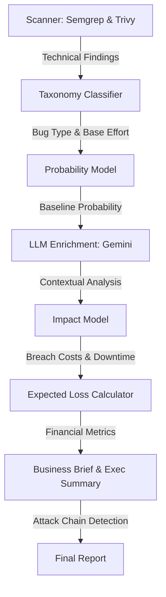

# CyberFinRisk Financial Engine Workflow

The **Financial Risk Engine** is the core intelligence of the CyberFinRisk platform. It transforms raw technical vulnerabilities into actionable financial metrics by combining actuarial models with Large Language Model (LLM) enrichment.

## 1. End-to-End Workflow

The engine follows a multi-stage pipeline to assess risk:

### Phase 1: Data Ingestion & Classification
Technical findings from **Semgrep** (Static Analysis) and **Trivy** (SCA/Secrets) are parsed and mapped to a internal **Bug Taxonomy**. This stage determines the baseline "Fix Effort" required to remediate the issue.

### Phase 2: Probability Assessment
The engine calculates the likelihood of exploitation based on:
- **Exposure**: Is the code internet-facing or internal?
- **Base Rates**: Industry data for the specific bug type.

### Phase 3: AI Enrichment (Gemini 2.5 Flash)
Gemini analyzes the **actual code context** and the **company profile** to:
- **Adjust Probability**: Lowers risk for admin-only or non-production code; raises it for user-input-driven logic.
- **Filter False Positives**: Confirms if the bug is actually exploitable in the specific business logic.
- **Business Context**: Explains what the code does in plain English.

### Phase 4: Financial Impact Modeling
The engine computes total potential impact across five categories:
1. **Data Breach Cost**: Records × Cost-per-Record (Industry-adjusted).
2. **Regulatory Fines**: GDPR, PCI DSS, and HIPAA penalties based on data types.
3. **Downtime Cost**: Operational loss per hour of unavailability.
4. **Reputation Damage**: Estimated customer churn (market-cap impact).
5. **Incident Response**: Forensics, legal, and notification costs.

---

## 2. Key Formulae

The engine uses standard actuarial principles to prioritize work:

| Metric | Formula | Description |
| :--- | :--- | :--- |
| **Expected Loss** | $P(Exploit) \times Total Impact$ | The actuarial "premium" of carrying the risk. |
| **Fix Cost** | $Remediation Hours \times Hourly Rate$ | The direct engineering cost to resolve. |
| **ROI** | $Expected Loss / Fix Cost$ | Saving multiple for every dollar spent. |
| **Priority Score** | $Expected Loss / Fix Hours$ | Revenue-at-risk saved per hour of work. |

---

## 3. Attack Chains

Beyond individual bugs, the engine uses LLM analysis to detect **Attack Chains**. This identifies sequences of vulnerabilities (e.g., *Path Traversal → Credential Leak*) that are significantly more dangerous when combined. 

Attack chains receive a **1.5x severity amplifier** to reflect the synergistic risk of multi-step exploitation.

---

## 4. Business Outputs

The workflow culminates in three primary views:
- **Executive Summary**: A board-level overview of total financial exposure and ROI.
- **Business Briefs**: Plain-English "What is broken?" and "How a breach happens" for non-technical owners.
- **Technical Guidance**: Context-specific fix instructions and complexity ratings.
